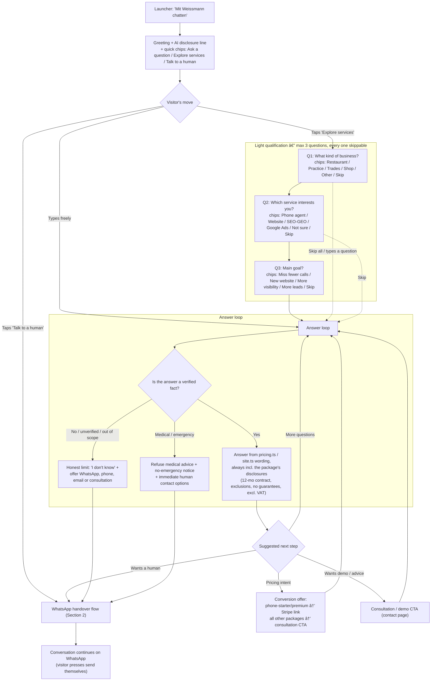

# "Chat with Weissmann" — Conversation UX Specification

**Mit Weissmann chatten · Chat with Weissmann · Chatta con Weissmann · Discutez avec Weissmann**

Scope: on-site AI assistant for weissmann.ai (Astro/Netlify, DE default + EN/IT/FR). The assistant may only state the verified facts in `src/data/pricing.ts` and `src/data/site.ts`. Everything else is an honest "I don't know" plus a human handover offer.

---

## 1. Conversation flow



**Always-available escape hatches** (persistent in the chat header/footer, every state, every language):

| Action | Behaviour |
|---|---|
| Ask directly | Free-text input is never disabled — typing anything exits qualification instantly |
| Skip | Every qualification question carries a Skip chip; skipping is never re-asked |
| WhatsApp | Opens the handover flow (Section 2) from any state |
| Book consultation | Links to the contact/consultation page in the current locale |
| Close chat | X in header; state kept for the session so reopening resumes |

**Answer-loop guardrails (hard rules):**

- Prices, minutes, languages, contract terms, revision rounds, exclusions come **verbatim** from `pricing.ts` — including the uncomfortable parts (12-month contract, "no ranking guarantees", "ad spend paid separately", "excl. VAT").
- Never invent: discounts, delivery times, business hours, integrations (TheFork etc. are unverified), availability, legal entity/UID, features.
- No ranking or citation guarantees, ever — restate the official disclosure instead.
- No medical advice, no emergency support — state limits and hand over.
- When unsure → the "I don't know" pattern + human contact. Unsureness is a feature, not a failure state.
- Stripe checkout is offered **only** for `phone-starter` and `phone-premium` (the only verified links); every other package gets the consultation CTA.

---

## 2. WhatsApp human handover — detailed flow

**Trigger points:** visitor taps "Talk to a human" / handover button, assistant hits an "I don't know", medical/emergency limit, or visitor asks anything contract-negotiable (discounts, custom terms).

### Steps

1. **Consent ask.** The assistant asks whether the visitor wants to continue with a human on WhatsApp and explains what happens next: a short summary will be drafted and shown for approval before anything is prepared. Nothing happens without a clear yes.

2. **Summary drafting.** The assistant composes a 1–2 sentence summary of the visitor's question **only from what the visitor said in this chat**, plus the selected/discussed service (if any). The generator strips anything sensitive: no names, phone numbers, emails, health information, financial details — even if the visitor typed them.

3. **Visitor approval.** The summary is shown as an editable preview: *"Here is the message I would prepare — you can edit it. OK to use?"* Chips: **Approve** / **Edit** / **Cancel**. The pre-filled message is built **only** from the visitor-approved text.

4. **Message construction.** The wa.me link is built from the approved summary using the locale template:

   | Locale | Template |
   |---|---|
   | DE | `Hallo Weissmann AI, ich habe gerade mit dem Website-Assistenten gesprochen. Ich interessiere mich für [service]. Meine Frage ist: [summary].` |
   | EN | `Hello Weissmann AI, I just spoke with the website assistant. I am interested in [service]. My question is: [summary].` |
   | IT | `Buongiorno Weissmann AI, ho appena parlato con l'assistente del sito web. Mi interessa [service]. La mia domanda è: [summary].` |
   | FR | `Bonjour Weissmann AI, je viens de parler avec l'assistant du site web. Je m'intéresse à [service]. Ma question est : [summary].` |

   `[service]` = the localized package name from `pricing.ts` (e.g. "KI-Telefonassistent Starter"). If no service was discussed, the sentence "Ich interessiere mich für […]." is dropped entirely — never filled with a guess.

   URL: `https://wa.me/41783459788?text=` + `encodeURIComponent(localizedMessage)` (same number as the existing site-wide `SITE.whatsapp` link; the chat builds its own `?text=` payload instead of the generic prefill).

5. **Outside-the-website notice.** Before the button, the assistant states clearly that tapping it opens WhatsApp and the conversation continues **outside the website, on WhatsApp** — and that the message is only a draft the visitor sends themselves.

6. **Availability honesty.** Business hours are not confirmed, so the assistant **never** claims someone is available now or will reply within X minutes. Standard fallback, all locales:

   | Locale | Fallback line |
   |---|---|
   | DE | Ich kann Ihnen nicht sagen, wann genau jemand antwortet. Sie können uns trotzdem auf WhatsApp schreiben – das Team meldet sich so schnell wie möglich. |
   | EN | I can't tell you exactly when someone will reply. You can still message us on WhatsApp — the team will get back to you as soon as possible. |
   | IT | Non posso dirle esattamente quando qualcuno risponderà. Può comunque scriverci su WhatsApp: il team la ricontatterà il prima possibile. |
   | FR | Je ne peux pas vous dire exactement quand quelqu'un répondra. Vous pouvez quand même nous écrire sur WhatsApp — l'équipe vous répondra dès que possible. |

7. **Analytics.** On tap of the final WhatsApp button (after approval, at the moment the wa.me link opens):

   ```js
   wmEvent('chat_whatsapp_transfer', {
     service: 'phone-starter',   // package id from pricing.ts, or 'none'
     locale: 'de',               // de | en | it | fr
     qualified: true,            // visitor completed ≥1 qualification question
     trigger: 'user_request'     // user_request | idk_fallback | limit_medical
   });
   ```

   Sent via the existing `wmEvent()` helper only — it already respects Consent Mode v2 (`analytics_storage` denied by default, consent read from `localStorage['wm-consent']`). **No free-text, no summary content, no personal data** ever enters the event payload.

### Non-negotiable handover rules

- **Never auto-send.** The chat only opens WhatsApp with a draft; the visitor presses send in WhatsApp. Also stated in the UI so the visitor knows nothing left their device yet.
- **Never include sensitive data** in the prefill (health, identity, payment, credentials) — stripped at drafting, and the visitor's edit is the final word.
- **Never claim immediate human availability** — always the Step 6 fallback.
- **Cancel is free.** Cancelling returns to the answer loop without nagging; phone (+41 78 345 97 88) and email (info@weissmann.ai) are offered as alternatives.

---

## 3. Example conversations

### 3a. German — phone agent pricing, honest 12-month disclosure

> **Assistent:** Grüezi! Ich bin der **KI-Assistent von Weissmann AI**. Antworten können unvollständig sein – wichtige Angaben bestätigt Ihnen unser Team gerne persönlich per WhatsApp. Wie kann ich helfen?
> `[Frage stellen]` `[Leistungen entdecken]` `[Mit einem Menschen sprechen]`
>
> **Besucher:** Was kostet euer KI-Telefonassistent?
>
> **Assistent:** Gerne – es gibt drei Pakete (alle Preise exkl. MwSt.):
>
> - **Starter – CHF 350 pro Monat:** 1500 Minuten pro Monat, danach CHF 0.30 pro Minute, 1 Sprache inklusive (DE/EN/FR/IT wählbar), dedizierte Telefonleitung inkl. Hosting. Keine Setup-Gebühr.
> - **Premium – CHF 990 pro Monat:** 3500 Minuten pro Monat, danach CHF 0.25 pro Minute, 2 Sprachen inklusive, Terminverwaltung und automatische Auskunft zu Angeboten. Keine Setup-Gebühr.
> - **Enterprise – Preis auf Anfrage:** 4 Sprachen, Voice-Cloning, Smart-Routing.
>
> Ehrlicherweise wichtig: **Starter und Premium haben einen 12-Monatsvertrag.** Das sollten Sie vor dem Abschluss wissen.
>
> **Besucher:** Gibt es auch eine kürzere Laufzeit oder einen Rabatt?
>
> **Assistent:** Das weiss ich nicht – mir liegen nur die Standardkonditionen mit 12-Monatsvertrag vor, und Rabatte oder Sonderlaufzeiten darf ich nicht zusagen. Das kann Ihnen nur unser Team beantworten. Möchten Sie die Frage per WhatsApp direkt an einen Menschen stellen?
> `[Auf WhatsApp fortsetzen]` `[Weiter im Chat]`
>
> **Besucher:** Funktioniert der Assistent mit unserem Reservationssystem TheFork?
>
> **Assistent:** Auch das kann ich Ihnen nicht mit Sicherheit sagen – konkrete Integrationen prüft das Team individuell für Ihren Fall, und ich möchte Ihnen nichts versprechen, was ich nicht belegen kann. Was ich sicher weiss: Premium umfasst die Verwaltung von Terminen und Kundenanfragen. Für die TheFork-Frage empfehle ich das direkte Gespräch.
>
> **Besucher:** Ok, dann nehme ich erstmal Starter.
>
> **Assistent:** Sehr gerne. Sie können den **KI-Telefonassistent Starter (CHF 350/Monat exkl. MwSt., 1500 Minuten, 1 Sprache, keine Setup-Gebühr, 12-Monatsvertrag)** direkt online abschliessen – oder zuerst eine Beratung buchen, wenn Sie die Integrationsfrage klären möchten.
> `[Jetzt abschliessen – Stripe]` `[Beratung buchen]` `[Per WhatsApp schreiben]`

*(Shows: AI disclosure · honest 12-month disclosure · two "I don't know → human" moments · verified Stripe CTA only for Starter.)*

### 3b. English — website package comparison → consultation CTA

> **Assistant:** Hi! I'm the **AI assistant from Weissmann AI**. My answers may be incomplete — for anything important you can reach our team directly on WhatsApp. What can I help with?
> `[Ask a question]` `[Explore services]` `[Talk to a human]`
>
> **Visitor:** What's the difference between your website packages?
>
> **Assistant:** We have three (one-time prices, excl. VAT):
>
> - **Starter Website — CHF 2,490:** up to 5 core pages, responsive design, contact/lead form, technical SEO & GEO foundation, GA4 + Search Console set up, 1 language, 2 defined revision rounds. To be transparent: **copywriting, additional languages and paid third-party tools are not included.**
> - **Business Website — CHF 4,990:** approx. 10–20 pages per approved scope, premium design, conversion-focused architecture and lead-generation system, multilingual-ready, blog/knowledge section, GA4 conversion tracking, 3 defined revision rounds.
> - **Complex / Custom Website — from CHF 9,900:** large multilingual architectures, custom applications, e-commerce, integrations, AI workflows. Final price depends on scope, so this one is consultation-only.
>
> **Visitor:** Which one do I need for a 12-page site in German and English?
>
> **Assistant:** Two languages and ~12 pages points towards the **Business Website** — it's multilingual-ready and covers roughly 10–20 pages. One honest note: the Starter package includes only 1 language, so it wouldn't fit as-is.
>
> **Visitor:** How fast can you deliver it?
>
> **Assistant:** I don't know — I don't have confirmed delivery times, and I'd rather not guess. Timelines depend on scope and are agreed in the consultation. Would you like to book one, or ask the team directly on WhatsApp?
>
> **Visitor:** A consultation sounds good.
>
> **Assistant:** Great — the consultation is where the team confirms scope, timeline and a fixed proposal for the Business Website (CHF 4,990 one-time, excl. VAT).
> `[Book a consultation]` `[Message us on WhatsApp]` `[Keep asking questions]`

*(Shows: AI disclosure · honest exclusions · "I don't know" on delivery time · consultation CTA, no Stripe for websites.)*

### 3c. Italian — "can you guarantee Google rankings?" → honest no + SEO Growth

> **Assistente:** Buongiorno! Sono l'**assistente AI di Weissmann AI**. Le risposte possono essere incomplete: per le questioni importanti può contattare direttamente il nostro team su WhatsApp. Come posso aiutarla?
> `[Fai una domanda]` `[Scopri i servizi]` `[Parla con una persona]`
>
> **Visitatore:** Potete garantirmi la prima posizione su Google?
>
> **Assistente:** No, e voglio essere onesto: **non offriamo alcuna garanzia di posizionamento** — nessuno può garantire seriamente una posizione su Google, perché il ranking dipende dall'algoritmo di Google e dalla concorrenza. Quello che facciamo è costruire le basi per una forte visibilità.
>
> Il nostro programma **SEO Growth (CHF 890 al mese, IVA esclusa)** comprende: audit tecnico iniziale e ricerca keyword con mappatura dell'intento di ricerca, ottimizzazione on-page e dei metadati, monitoraggio Search Console, manutenzione SEO tecnica, raccomandazioni per contenuti e SEO locale, e un report mensile con piano d'azione prioritizzato.
>
> Per trasparenza, **non** sono inclusi: redazione di contenuti, lavori di sviluppo e outreach per backlink (le raccomandazioni sì).
>
> **Visitatore:** E in quanto tempo arriverei in prima pagina?
>
> **Assistente:** Non lo so, e non posso prometterle tempi: dipende dal settore, dalla concorrenza e dal punto di partenza del sito. Chi le promette risultati garantiti in X settimane non è sincero. Se vuole una valutazione realistica del suo caso, il team può darle un parere diretto.
> `[Prenota una consulenza]` `[Scrivici su WhatsApp]`
>
> **Visitatore:** E per essere trovato da ChatGPT?
>
> **Assistente:** Per quello esiste **GEO Authority (CHF 990 al mese, IVA esclusa)**: audit di preparazione per la ricerca AI, ottimizzazione dei contenuti citabili e delle FAQ, llms.txt e report mensile coordinato con la SEO. Anche qui, con onestà: la GEO supporta il **potenziale** di visibilità nei motori di risposta AI, ma **non può garantire citazioni o inclusione**.
> `[Prenota una consulenza]` `[Scrivici su WhatsApp]`

*(Shows: AI disclosure · honest no-guarantee twice (SEO + GEO) · honest "non lo so" on timing → human offer.)*

### 3d. French — healthcare admin → limits + no-medical-advice + full handover

> **Assistant :** Bonjour ! Je suis l'**assistant IA de Weissmann AI**. Mes réponses peuvent être incomplètes — pour toute question importante, vous pouvez joindre notre équipe directement sur WhatsApp. Comment puis-je vous aider ?
> `[Poser une question]` `[Découvrir les services]` `[Parler à un humain]`
>
> **Visiteur :** Nous sommes un cabinet médical. Votre agent téléphonique peut-il gérer les appels des patients et répondre à leurs questions médicales ?
>
> **Assistant :** Merci pour votre question — je dois être précis sur ce point.
>
> Ce que l'agent téléphonique IA peut faire pour un cabinet : gérer les rendez-vous et les demandes des clients, donner des informations automatiques sur vos offres et services, avec une ligne téléphonique dédiée (Starter : CHF 350/mois, 1 langue ; Premium : CHF 990/mois, 2 langues ; prix hors TVA, contrat de 12 mois, sans frais d'installation).
>
> Ce qu'il ne fait **pas**, et je préfère le dire clairement : **il ne donne aucun conseil médical et ne prend pas en charge les urgences.** Les appels nécessitant un jugement médical doivent toujours être dirigés vers votre personnel ou les services d'urgence — c'est une limite ferme.
>
> **Visiteur :** D'accord. Et comment gérez-vous exactement le renvoi des urgences ? Vous êtes joignables à quelles heures pour en discuter ?
>
> **Assistant :** La configuration exacte du renvoi d'appels est définie individuellement avec l'équipe — je ne peux pas vous donner de détails fiables ici. Et honnêtement, je ne connais pas nos horaires de disponibilité, je ne veux donc pas vous en inventer. Je ne peux pas vous dire exactement quand quelqu'un répondra. Vous pouvez quand même nous écrire sur WhatsApp — l'équipe vous répondra dès que possible. Souhaitez-vous que je prépare le transfert ?
> `[Continuer sur WhatsApp]` `[Non merci]`
>
> **Visiteur :** Oui, préparez ça.
>
> **Assistant :** Voici le message que je préparerais — vous pouvez le modifier avant de continuer :
>
> > *Bonjour Weissmann AI, je viens de parler avec l'assistant du site web. Je m'intéresse à l'Agent téléphonique IA Premium. Ma question est : configuration d'un agent téléphonique pour un cabinet médical — gestion des rendez-vous et renvoi correct des appels urgents vers le personnel.*
>
> Aucune donnée personnelle ou médicale n'y figure. Est-ce que cela vous convient ?
> `[Approuver]` `[Modifier]` `[Annuler]`
>
> **Visiteur :** `[Approuver]`
>
> **Assistant :** Parfait. En appuyant sur le bouton, WhatsApp s'ouvre avec ce message pré-rempli — **rien n'est envoyé automatiquement**, c'est vous qui appuyez sur « envoyer ». La conversation se poursuivra ensuite **en dehors de ce site web, sur WhatsApp**.
> `[Ouvrir WhatsApp]` *(→ wa.me/41783459788?text=… · déclenche `wmEvent('chat_whatsapp_transfer', { service: 'phone-premium', locale: 'fr', qualified: false, trigger: 'limit_medical' })`)*

*(Shows: AI disclosure · no-medical-advice + no-emergency limit · unconfirmed-hours honesty with the standard fallback · full consent → summary approval → no-auto-send handover.)*

---

## 4. Microcopy pack

### Launcher label
| | |
|---|---|
| DE | Mit Weissmann chatten |
| EN | Chat with Weissmann |
| IT | Chatta con Weissmann |
| FR | Discutez avec Weissmann |

### Disclosure line (pinned under the first message, always visible in the header on scroll)
| | |
|---|---|
| DE | KI-Assistent von Weissmann AI. Antworten können unvollständig sein – wichtige Angaben bestätigt Ihnen unser Team persönlich per WhatsApp oder E-Mail. |
| EN | AI assistant from Weissmann AI. Answers may be incomplete — our team will confirm anything important personally via WhatsApp or email. |
| IT | Assistente AI di Weissmann AI. Le risposte possono essere incomplete: il nostro team conferma personalmente ogni informazione importante via WhatsApp o e-mail. |
| FR | Assistant IA de Weissmann AI. Les réponses peuvent être incomplètes — notre équipe confirme personnellement toute information importante par WhatsApp ou e-mail. |

### Consent line (before WhatsApp handover)
| | |
|---|---|
| DE | Möchten Sie das Gespräch mit einem Menschen auf WhatsApp fortsetzen? Ich erstelle dazu eine kurze Zusammenfassung, die Sie vor dem Öffnen von WhatsApp prüfen und anpassen können. Gesendet wird nichts automatisch. |
| EN | Would you like to continue with a human on WhatsApp? I'll draft a short summary that you can review and edit before WhatsApp opens. Nothing is sent automatically. |
| IT | Vuole continuare la conversazione con una persona su WhatsApp? Preparo un breve riepilogo che potrà controllare e modificare prima dell'apertura di WhatsApp. Nulla viene inviato automaticamente. |
| FR | Souhaitez-vous poursuivre avec un humain sur WhatsApp ? Je prépare un court résumé que vous pourrez vérifier et modifier avant l'ouverture de WhatsApp. Rien n'est envoyé automatiquement. |

### Handover button
| | |
|---|---|
| DE | Auf WhatsApp fortsetzen |
| EN | Continue on WhatsApp |
| IT | Continua su WhatsApp |
| FR | Continuer sur WhatsApp |

### Error message (answer failed / backend error)
| | |
|---|---|
| DE | Entschuldigung, da ist etwas schiefgelaufen. Bitte versuchen Sie es noch einmal – oder erreichen Sie uns direkt per WhatsApp, unter +41 78 345 97 88 oder info@weissmann.ai. |
| EN | Sorry, something went wrong. Please try again — or reach us directly on WhatsApp, at +41 78 345 97 88 or info@weissmann.ai. |
| IT | Ci scusiamo, qualcosa è andato storto. Riprovi, per favore — oppure ci contatti direttamente su WhatsApp, al +41 78 345 97 88 o a info@weissmann.ai. |
| FR | Désolé, une erreur s'est produite. Veuillez réessayer — ou contactez-nous directement sur WhatsApp, au +41 78 345 97 88 ou à info@weissmann.ai. |

### Offline message (assistant unavailable — no business-hours claim, ever)
| | |
|---|---|
| DE | Der Assistent ist gerade nicht verfügbar. Sie können uns trotzdem auf WhatsApp schreiben, uns unter +41 78 345 97 88 anrufen oder an info@weissmann.ai schreiben – das Team meldet sich so schnell wie möglich. |
| EN | The assistant is currently unavailable. You can still message us on WhatsApp, call +41 78 345 97 88 or write to info@weissmann.ai — the team will get back to you as soon as possible. |
| IT | L'assistente non è al momento disponibile. Può comunque scriverci su WhatsApp, chiamarci al +41 78 345 97 88 o scrivere a info@weissmann.ai: il team la ricontatterà il prima possibile. |
| FR | L'assistant est momentanément indisponible. Vous pouvez quand même nous écrire sur WhatsApp, nous appeler au +41 78 345 97 88 ou écrire à info@weissmann.ai — l'équipe vous répondra dès que possible. |

**Style notes:** Swiss German orthography throughout (ss, never ß); formal address in all four languages (Sie / Lei / vous); package names, prices and disclosures must render from `pricing.ts` at build time — never hardcoded in chat copy — so the chat can never drift from the site (same single-source rule that governs the pricing pages).
